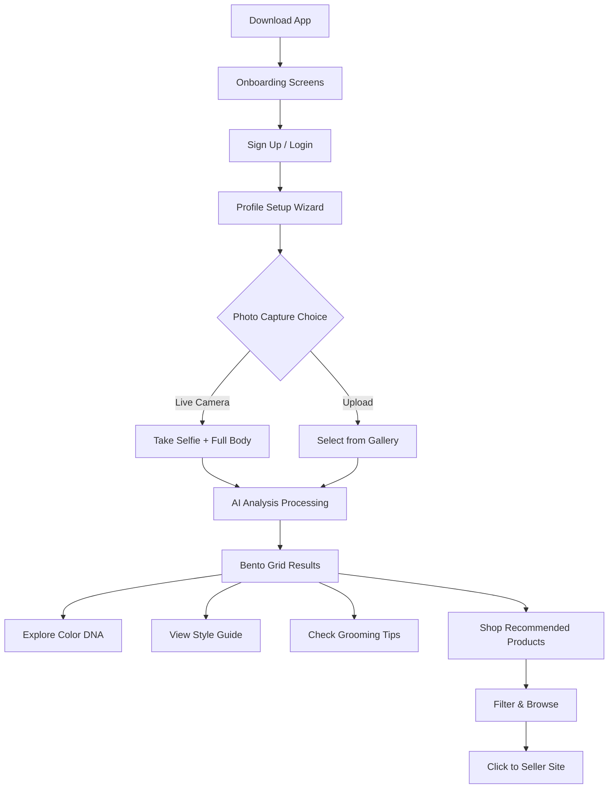
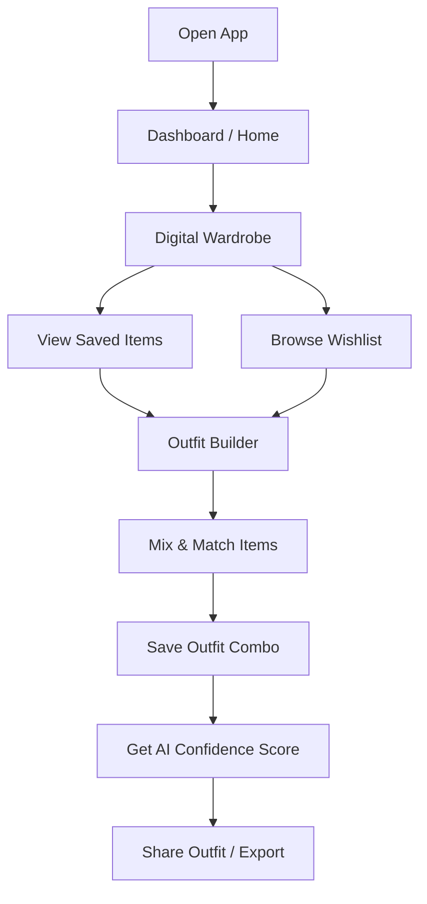
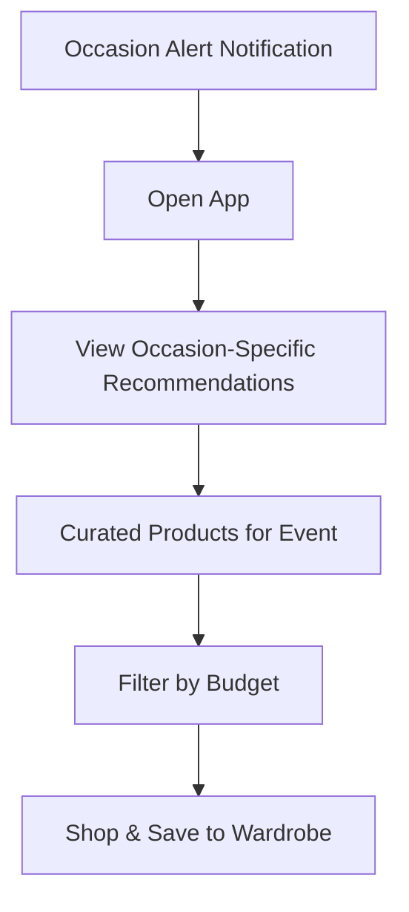
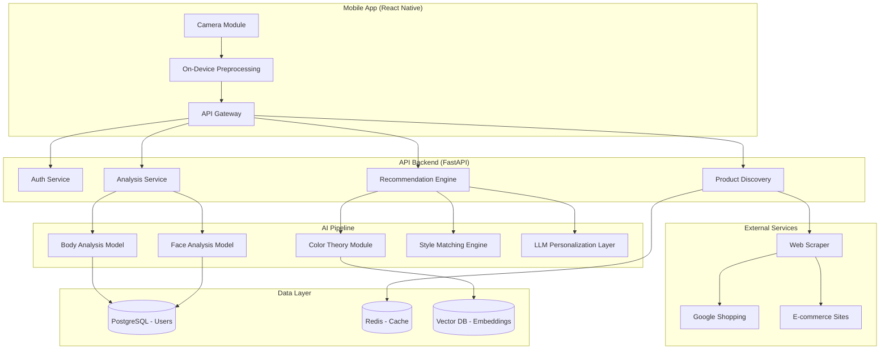
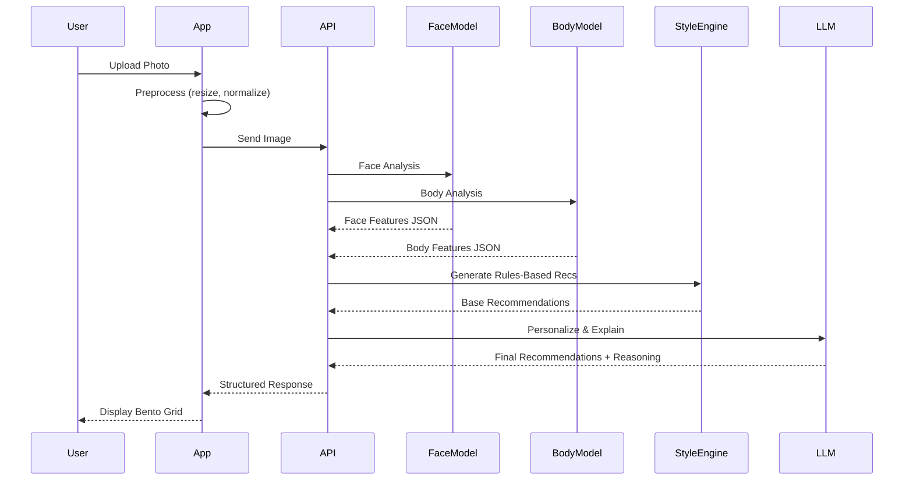
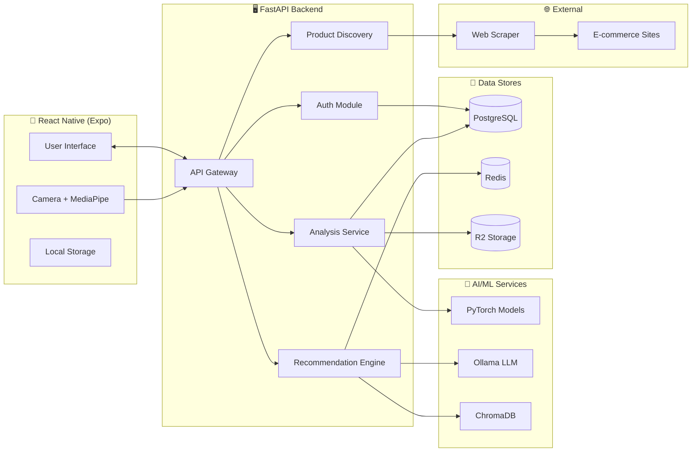
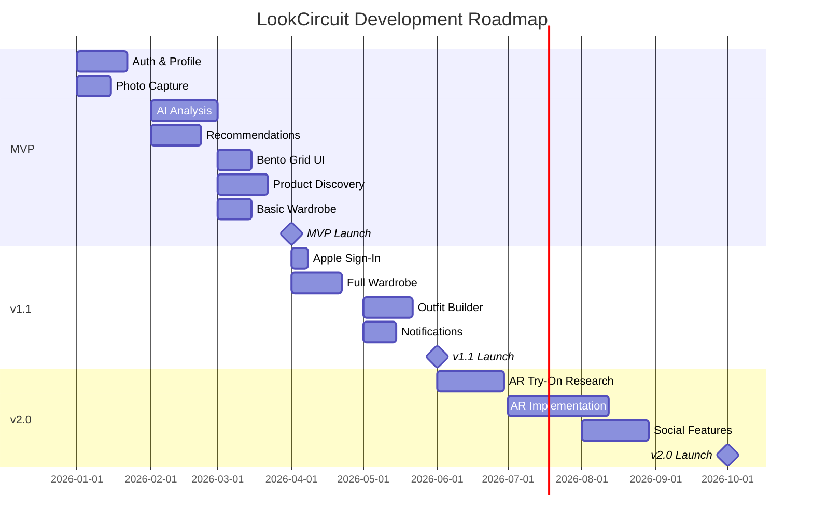

# LookCircuit — Product Requirements Document (PRD)

**Version:** 1.0  
**Date:** January 2, 2026  
**Author:** Product & AI Architecture Team  
**Status:** Draft for Review

---

## Table of Contents

1. [Executive Summary](#1-executive-summary)
2. [Problem Statement](#2-problem-statement)
3. [Target Users & Personas](#3-target-users--personas)
4. [User Journeys](#4-user-journeys)
5. [Functional Requirements](#5-functional-requirements)
6. [AI System Architecture](#6-ai-system-architecture)
7. [Technology Stack](#7-technology-stack)
8. [Non-Functional Requirements](#8-non-functional-requirements)
9. [MVP vs. Future Roadmap](#9-mvp-vs-future-roadmap)
10. [Success Metrics & KPIs](#10-success-metrics--kpis)
11. [Risks & Constraints](#11-risks--constraints)
12. [Assumptions](#12-assumptions)
13. [Appendix — Additional Features](#13-appendix--additional-features)

---

## 1. Executive Summary

**LookCircuit** is an AI-powered personal fashion consultant and smart shopping assistant designed for mobile platforms (Android & iOS) with an API-first backend architecture.

### Vision
Democratize personalized fashion intelligence by combining computer vision, AI recommendations, and real-time product discovery—enabling every user to dress confidently without the confusion of trends, body-type rules, or budget limitations.

### Core Value Proposition
| For | We Provide |
|-----|-----------|
| Fashion-conscious individuals | Deeply personalized, gender-specific style recommendations |
| Users confused by fashion rules | Clear, actionable guidance on colors, fits, and grooming |
| Bald/thinning-hair users | Alternative styling guidance (beard styles, accessories, necklines) |
| Budget-aware shoppers | Real, purchasable products filtered by price and preference |

### Business Model (Planned)
- **Freemium:** Core analysis free, premium features (unlimited refreshes, advanced wardrobe) via subscription
- **Affiliate Revenue:** Product click-through commissions from e-commerce partners
- **Data Insights:** Anonymized trend data for fashion brands (future)

---

## 2. Problem Statement

### The Challenge
Modern consumers face **decision paralysis** when shopping for fashion and grooming products:

1. **Information Overload:** Thousands of products, contradictory style advice, and fleeting trends
2. **Generic Recommendations:** E-commerce platforms optimize for sales, not individual suitability
3. **Lack of Self-Awareness:** Most users don't understand their face shape, skin undertone, or body type
4. **Underserved Segments:** Bald/thinning-hair users, diverse body types, and budget-conscious shoppers lack tailored guidance
5. **Fragmented Experience:** Users must manually translate "wear warm colors" into actual products they can buy

### The Opportunity
> **64% of consumers want personalized shopping experiences, but only 22% feel brands deliver.**  
> — Segment 2023 Personalization Report

LookCircuit bridges the gap between **understanding what suits you** and **finding products that match**—creating a closed-loop personalization engine.

---

## 3. Target Users & Personas

### Primary Personas

#### Persona 1: Arjun — The Overwhelmed Professional
| Attribute | Details |
|-----------|---------|
| **Age** | 28 |
| **Gender** | Male |
| **Occupation** | Software Engineer |
| **Pain Points** | Doesn't know what colors suit him; buys random formal wear; wants to look polished for presentations |
| **Goals** | Build a capsule wardrobe; get quick, trustworthy recommendations |
| **Behavior** | Shops online 2-3x/month on Amazon/Myntra; price-sensitive |

#### Persona 2: Priya — The Fashion Explorer
| Attribute | Details |
|-----------|---------|
| **Age** | 24 |
| **Gender** | Female |
| **Occupation** | Freelance Designer |
| **Pain Points** | Loves experimenting but wastes money on items that don't suit her; confused by skin undertones |
| **Goals** | Discover her "style DNA"; find unique ethnic + fusion pieces |
| **Behavior** | Active on Instagram; saves inspiration; buys from niche brands |

#### Persona 3: Vikram — The Bald & Bold
| Attribute | Details |
|-----------|---------|
| **Age** | 35 |
| **Gender** | Male |
| **Occupation** | Entrepreneur |
| **Pain Points** | Traditional style advice centers on hair; unsure about beard styles, accessory choices |
| **Goals** | Embrace baldness with confidence; find glasses, hats, and necklines that work |
| **Behavior** | Prefers quality over quantity; shops on Flipkart and Amazon |

#### Persona 4: Sneha — The Budget-Smart Student
| Attribute | Details |
|-----------|---------|
| **Age** | 21 |
| **Gender** | Female |
| **Occupation** | College Student |
| **Pain Points** | Limited budget; overwhelmed by choices; wants to look good without overspending |
| **Goals** | Get maximum value; know exactly what works before buying |
| **Behavior** | Compares prices; loves discounts and sales |

### Secondary Segments
- **Fitness Enthusiasts:** Athletic body types needing performance + style balance
- **Occasion Shoppers:** Users preparing for weddings, interviews, festivals
- **Parents:** Shopping for family members with different body types

---

## 4. User Journeys

### Journey 1: First-Time User — Profile to Recommendations

**Timeline:** 5–8 minutes from download to first product discovery

---

### Journey 2: Returning User — Wardrobe & Outfit Building

---

### Journey 3: Occasion-Based Shopping

---

## 5. Functional Requirements

### 5.1 User Onboarding & Profile

#### FR-1.1: Authentication
| ID | Requirement | Priority |
|----|-------------|----------|
| FR-1.1.1 | Support Email/Password signup and login | P0 |
| FR-1.1.2 | Support OAuth 2.0 via Google Sign-In | P0 |
| FR-1.1.3 | Support Sign in with Apple | P0 |
| FR-1.1.4 | Implement secure password reset via email OTP | P1 |
| FR-1.1.5 | Display clean, modern, premium login UI with brand identity | P0 |

#### FR-1.2: Profile Setup
| ID | Requirement | Priority |
|----|-------------|----------|
| FR-1.2.1 | Collect **Gender** (mandatory) — Male, Female, Non-Binary, Prefer Not to Say | P0 |
| FR-1.2.2 | Collect **Age Range** — dropdown with 5-year buckets | P0 |
| FR-1.2.3 | Collect **Height & Weight** (optional) — for body type refinement | P1 |
| FR-1.2.4 | Collect **Lifestyle** — multi-select: Student, Professional, Casual, Fitness, Creative | P0 |
| FR-1.2.5 | Collect **Fashion Preference** — multi-select: Minimal, Streetwear, Formal, Ethnic, Casual, Sporty, Bohemian | P0 |
| FR-1.2.6 | Collect **Budget Sensitivity** — slider: Budget (₹), Mid-Range, Premium | P0 |
| FR-1.2.7 | Allow users to skip optional fields and complete later | P1 |
| FR-1.2.8 | Display progress indicator during multi-step onboarding | P1 |

---

### 5.2 Face & Body Analysis

#### FR-2.1: Image Capture
| ID | Requirement | Priority |
|----|-------------|----------|
| FR-2.1.1 | Provide in-app camera interface with real-time face detection overlay | P0 |
| FR-2.1.2 | Support gallery upload for existing photos | P0 |
| FR-2.1.3 | Require minimum image resolution of 720p for accurate analysis | P0 |
| FR-2.1.4 | Display positioning guides (face oval, body frame) during capture | P1 |
| FR-2.1.5 | Support both selfie (front) and full-body (rear camera) capture modes | P1 |

#### FR-2.2: AI Analysis — Face
| ID | Requirement | Priority |
|----|-------------|----------|
| FR-2.2.1 | Detect **Face Shape** — Oval, Round, Square, Heart, Oblong, Diamond | P0 |
| FR-2.2.2 | Detect **Skin Tone** — Fitzpatrick scale (I–VI) | P0 |
| FR-2.2.3 | Detect **Undertone** — Cool, Warm, Neutral | P0 |
| FR-2.2.4 | Analyze **Facial Features** — Jawline definition, forehead ratio, beard potential | P1 |
| FR-2.2.5 | Detect visible **Skin Concerns** — Dullness, dark circles, acne, uneven texture | P1 |
| FR-2.2.6 | **Baldness/Thinning Detection** — Trigger alternative grooming recommendations | P0 |

#### FR-2.3: AI Analysis — Body
| ID | Requirement | Priority |
|----|-------------|----------|
| FR-2.3.1 | Classify **Body Type** — Ectomorph, Mesomorph, Endomorph (simplified) | P0 |
| FR-2.3.2 | Classify **Body Shape** — Rectangle, Triangle, Inverted Triangle, Hourglass, Apple, Pear | P0 |
| FR-2.3.3 | Estimate proportions (shoulder-to-hip ratio) for fit recommendations | P1 |

#### FR-2.4: Privacy & Data Handling
| ID | Requirement | Priority |
|----|-------------|----------|
| FR-2.4.1 | Process images on-device when possible (edge inference) | P1 |
| FR-2.4.2 | If cloud processing is required, delete raw images within 24 hours | P0 |
| FR-2.4.3 | Store only derived feature vectors, never raw photos server-side | P0 |
| FR-2.4.4 | Allow users to delete all their data with one-tap action | P0 |

---

### 5.3 AI Fashion Intelligence Engine

#### FR-3.1: Color Recommendations
| ID | Requirement | Priority |
|----|-------------|----------|
| FR-3.1.1 | Generate **Best Colors** palette (8–12 colors) based on skin tone + undertone | P0 |
| FR-3.1.2 | Generate **Colors to Avoid** list with reasoning | P0 |
| FR-3.1.3 | Apply **Seasonal Color Theory** — categorize user as Spring, Summer, Autumn, Winter | P1 |
| FR-3.1.4 | Show color swatches with HEX codes for reference | P1 |

#### FR-3.2: Style & Fit Recommendations
| ID | Requirement | Priority |
|----|-------------|----------|
| FR-3.2.1 | Recommend **Clothing Fits** — Slim, Regular, Relaxed, Oversized based on body type | P0 |
| FR-3.2.2 | Recommend **Neckline Styles** — V-neck, Crew, Mandarin, etc. based on face shape | P0 |
| FR-3.2.3 | Provide **Pattern Guidance** — Stripes, solids, prints suitability | P1 |
| FR-3.2.4 | Tailor all recommendations by **gender + lifestyle + preference** | P0 |

#### FR-3.3: Hairstyle & Grooming
| ID | Requirement | Priority |
|----|-------------|----------|
| FR-3.3.1 | Recommend **Hairstyles** based on face shape + hair condition | P0 |
| FR-3.3.2 | For bald/thinning users: Recommend **Beard Styles**, accessory choices, statement glasses | P0 |
| FR-3.3.3 | Suggest **Grooming Routines** — Beard maintenance, skincare steps | P1 |

#### FR-3.4: Accessories
| ID | Requirement | Priority |
|----|-------------|----------|
| FR-3.4.1 | Recommend **Eyewear Shapes** based on face shape | P0 |
| FR-3.4.2 | Recommend **Watch Styles** based on overall aesthetic | P1 |
| FR-3.4.3 | Recommend **Footwear Types** by occasion and body proportions | P1 |

#### FR-3.5: Occasion-Based Styling
| ID | Requirement | Priority |
|----|-------------|----------|
| FR-3.5.1 | Generate complete outfits for: Casual, Work, Formal Events, Festive, Fitness | P0 |
| FR-3.5.2 | Adjust recommendations based on selected occasion | P0 |

#### FR-3.6: Skincare Tips
| ID | Requirement | Priority |
|----|-------------|----------|
| FR-3.6.1 | Provide non-medical, lifestyle-safe skincare tips based on detected concerns | P1 |
| FR-3.6.2 | Include disclaimer: "Not medical advice — consult a dermatologist for persistent issues" | P0 |

#### FR-3.7: Explainable AI
| ID | Requirement | Priority |
|----|-------------|----------|
| FR-3.7.1 | Provide **AI Confidence Score** (70–100%) for each recommendation | P1 |
| FR-3.7.2 | Display **"Why This Works"** explanations in simple language | P0 |
| FR-3.7.3 | Avoid exposing raw ML metrics; translate to user-friendly reasoning | P0 |

---

### 5.4 Recommendations Display — Bento Grid

#### FR-4.1: Layout & Structure
| ID | Requirement | Priority |
|----|-------------|----------|
| FR-4.1.1 | Display all insights in a **visually rich bento-grid layout** | P0 |
| FR-4.1.2 | Include sections: Color DNA, Style Guide, Grooming & Hair/Beard, Skincare Tips, Pro Styling Tips | P0 |
| FR-4.1.3 | Make each tile **tappable** for detailed view | P0 |

#### FR-4.2: Tile Interactions
| ID | Requirement | Priority |
|----|-------------|----------|
| FR-4.2.1 | Each tile must be **saveable** to user's profile | P0 |
| FR-4.2.2 | Each tile must be **shareable** via native share sheet | P0 |
| FR-4.2.3 | Support **deep-linking** to specific tiles | P1 |

#### FR-4.3: Visual Design
| ID | Requirement | Priority |
|----|-------------|----------|
| FR-4.3.1 | Use card-based design with subtle shadows and rounded corners | P0 |
| FR-4.3.2 | Implement smooth micro-animations on tile appearance | P1 |
| FR-4.3.3 | Support dark mode and light mode themes | P1 |

---

### 5.5 Smart Product Discovery

#### FR-5.1: Product Search Engine
| ID | Requirement | Priority |
|----|-------------|----------|
| FR-5.1.1 | Convert AI recommendations into **real product search queries** | P0 |
| FR-5.1.2 | Aggregate results from Amazon, Flipkart, Myntra, Ajio via **web scraping / Google Shopping results** | P0 |
| FR-5.1.3 | Cache product results for 24 hours to reduce API calls | P1 |

#### FR-5.2: Product Display
| ID | Requirement | Priority |
|----|-------------|----------|
| FR-5.2.1 | Display: Product Image, Name, Short Description, Platform Logo, Price, Rating | P0 |
| FR-5.2.2 | Show "Recommended for You" badge with match reason | P1 |
| FR-5.2.3 | Clicking product → **redirect to seller page** (new browser tab / in-app browser) | P0 |

#### FR-5.3: Filters & Sorting
| ID | Requirement | Priority |
|----|-------------|----------|
| FR-5.3.1 | Filter by **Price Range** (custom min-max) | P0 |
| FR-5.3.2 | Filter by **Color** (from user's recommended palette) | P0 |
| FR-5.3.3 | Filter by **Occasion** | P0 |
| FR-5.3.4 | Filter by **Brand** (discovered brands) | P1 |
| FR-5.3.5 | Filter by **Rating** (4+, 4.5+ stars) | P1 |
| FR-5.3.6 | Sort by: Relevance, Price Low-High, Price High-Low, Rating | P0 |

---

### 5.6 Digital Wardrobe

#### FR-6.1: Item Management
| ID | Requirement | Priority |
|----|-------------|----------|
| FR-6.1.1 | Save **Owned Items** — items user already owns (manual entry + photo) | P0 |
| FR-6.1.2 | Save **Wishlist Items** — products discovered in app | P0 |
| FR-6.1.3 | Categorize by: Tops, Bottoms, Footwear, Accessories, Outerwear, Ethnic | P0 |
| FR-6.1.4 | Add tags: Season, Occasion, Color | P1 |

#### FR-6.2: Outfit Builder
| ID | Requirement | Priority |
|----|-------------|----------|
| FR-6.2.1 | Allow users to **mix & match items** from wardrobe to create outfits | P1 |
| FR-6.2.2 | Provide **AI suggestion** for completing outfits (missing accessories, shoes) | P2 |
| FR-6.2.3 | Save outfit combinations for quick access | P1 |

#### FR-6.3: Future-Ready (Planned)
| ID | Requirement | Priority |
|----|-------------|----------|
| FR-6.3.1 | **Virtual Try-On** — AR-based clothing overlay (post-MVP) | P3 |
| FR-6.3.2 | **Wardrobe Analytics** — cost-per-wear, most worn items | P3 |

---

### 5.7 Additional Smart Features

#### FR-7.1: Seasonal Refresh Reminders
| ID | Requirement | Priority |
|----|-------------|----------|
| FR-7.1.1 | Send push notifications before season changes (Spring, Summer, Autumn, Winter) | P2 |
| FR-7.1.2 | Suggest wardrobe updates based on season + user preferences | P2 |

#### FR-7.2: Occasion Alerts
| ID | Requirement | Priority |
|----|-------------|----------|
| FR-7.2.1 | Allow users to add upcoming occasions (weddings, interviews, festivals) | P2 |
| FR-7.2.2 | Send reminder with curated outfit/product suggestions 7 days before | P2 |

#### FR-7.3: Privacy Controls
| ID | Requirement | Priority |
|----|-------------|----------|
| FR-7.3.1 | Prominent **Delete All My Data** button in settings | P0 |
| FR-7.3.2 | Granular consent toggles for: Image storage, Analytics, Notifications | P1 |
| FR-7.3.3 | GDPR & data protection compliance ready | P1 |

---

## 6. AI System Architecture

### 6.1 High-Level Architecture

### 6.2 AI Models Overview

| Component | Model / Approach | Purpose |
|-----------|-----------------|---------|
| **Face Detection** | MediaPipe Face Mesh | Landmark detection for face shape classification |
| **Skin Analysis** | Custom CNN (PyTorch) | Tone (Fitzpatrick), undertone, concern detection |
| **Body Estimation** | MediaPipe Pose / OpenPose | Body landmark detection for proportion analysis |
| **Hair/Baldness Detection** | Classification CNN | Detect hair coverage level |
| **Color Recommendations** | Rule-based + ML hybrid | Color theory + personalized adjustments |
| **Style Generation** | Fine-tuned LLM (LLaMA 3.2 via Ollama) | Natural language style recommendations |
| **Product Matching** | Embeddings + Semantic Search | Match recommendations to product descriptions |

### 6.3 Inference Pipeline

### 6.4 Bias Mitigation Strategy

| Risk | Mitigation |
|------|-----------|
| Skin tone bias in detection | Train on diverse datasets (SCUT-FBP, FFHQ diversity subsets) |
| Gender-stereotyped recommendations | Review by diverse focus groups; allow preference overrides |
| Body type stigmatization | Frame recommendations positively ("what flatters you") not negatively |
| Western-centric color theory | Include regional/cultural adjustments for South Asian, East Asian palettes |

---

## 7. Technology Stack

> **Constraint:** All tools must be **free** (open-source or free-tier).

### 7.1 Mobile App

| Layer | Technology | Notes |
|-------|------------|-------|
| **Framework** | React Native (Expo) | Cross-platform, free, large ecosystem |
| **State Management** | Zustand | Lightweight, TypeScript-friendly |
| **Navigation** | React Navigation | Industry standard |
| **Camera** | Expo Camera + MediaPipe | On-device face mesh |
| **UI Components** | React Native Paper / NativeWind | Material Design + Tailwind-style |
| **Storage** | AsyncStorage + SQLite (Expo) | Offline wardrobe support |

### 7.2 Backend

| Layer | Technology | Notes |
|-------|------------|-------|
| **Framework** | FastAPI (Python) | High-performance, async, OpenAPI auto-docs |
| **Auth** | Supabase Auth (free tier) | OAuth, email, secure token management |
| **Database** | PostgreSQL (Supabase free tier / Neon) | Relational data, user profiles |
| **Cache** | Redis (Upstash free tier) | Session, product cache |
| **Object Storage** | Cloudflare R2 (10GB free) / Supabase Storage | Temporary image storage |
| **Task Queue** | Celery + Redis | Background processing |

### 7.3 AI / ML

| Component | Technology | Notes |
|-----------|------------|-------|
| **Face & Body** | MediaPipe + PyTorch | Open-source, on-device capable |
| **Skin Analysis** | Custom CNN (PyTorch) | Trained on open datasets |
| **LLM** | Ollama + LLaMA 3.2 (8B) | Local inference, no API cost |
| **Vector DB** | ChromaDB / Qdrant | Open-source embedding storage |
| **ML Ops** | MLflow | Experiment tracking (free, self-hosted) |

### 7.4 Product Discovery

| Component | Technology | Notes |
|-----------|------------|-------|
| **Web Scraping** | Playwright + BeautifulSoup | Headless browser for dynamic sites |
| **Proxy Rotation** | Free proxy lists / residential rotation | Avoid rate limits |
| **Search Aggregation** | SerpAPI free tier (100 searches/month) → fallback to direct scraping | Google Shopping results |

### 7.5 Infrastructure

| Component | Technology | Notes |
|-----------|------------|-------|
| **Containerization** | Docker | Free, portable |
| **Orchestration** | Docker Compose (dev) / Kubernetes (production on free VMs) | Scalability |
| **Hosting** | Railway.app (free tier) / Render / Fly.io | Free compute with limits |
| **CDN** | Cloudflare (free tier) | Edge caching, security |
| **Monitoring** | Grafana Cloud (free tier) + Loki | Observability |
| **CI/CD** | GitHub Actions | Free for open-source, generous for private |

### 7.6 Architecture Diagram

### 7.7 Future Recommended Paid Tier (Scalability & Reliability)

> **Note:** While the MVP uses strictly free tiers, the following paid upgrades are recommended for production stability and scale.

| Component | Recommended Tool | Cost (Est.) | Benefit |
|-----------|------------------|-------------|---------|
| **Authentication** | **Clerk** | $0.02/MAU | Specialized User Management, better DX than basic Supabase Auth |
| **Search API** | **SerpAPI / Zinc** | $50/mo | Reliable structured Google Shopping data without scraping blocks |
| **LLM Inference** | **OpenAI / Claude API** | Usage based | Higher quality reasoning than local LLaMA, faster response |
| **Hosting** | **AWS / Vercel Pro** | $20/mo+ | Better uptime, global CDN, auto-scaling |
| **Proxies** | **BrightData** | $10/GB | Enterprise-grade residential proxies to bypass scraping defenses |

---

## 8. Non-Functional Requirements

### 8.1 Performance

| Metric | Target |
|--------|--------|
| Image upload to recommendations | < 3 seconds (P95) |
| Product search results | < 2 seconds (P95) |
| App cold start | < 3 seconds |
| API response time | < 500ms (P95) for non-AI endpoints |

### 8.2 Scalability

| Requirement | Approach |
|-------------|----------|
| Concurrent users | Horizontal pod scaling (Kubernetes) |
| AI inference | Queue-based processing with Celery |
| Database | Connection pooling, read replicas (when needed) |

### 8.3 Security

| Category | Requirements |
|----------|-------------|
| Authentication | OAuth 2.0, JWT with short expiry, refresh tokens |
| Data in Transit | TLS 1.3 for all connections |
| Data at Rest | AES-256 encryption for sensitive fields |
| Image Handling | Signed URLs (expire in 1 hour), no permanent storage of raw images |
| PII | Minimize collection; pseudonymization where possible |

### 8.4 Privacy

| Requirement | Implementation |
|-------------|---------------|
| GDPR Ready | Data export, deletion APIs |
| Image Deletion | Auto-delete raw images within 24 hours |
| Consent | Granular toggles in settings |
| Transparency | Clear privacy policy, in-app summaries |

### 8.5 Reliability

| Metric | Target |
|--------|--------|
| Uptime | 99.5% (monthly) |
| Error Rate | < 0.5% for API calls |
| Recovery Time | < 30 minutes for critical incidents |

### 8.6 Accessibility

| Requirement | Standard |
|-------------|----------|
| Screen Reader Support | WCAG 2.1 AA |
| Color Contrast | Minimum 4.5:1 for text |
| Touch Targets | Minimum 44×44 dp |

---

## 9. MVP vs. Future Roadmap

### 9.1 MVP (v1.0) — 12 Weeks

| Feature | Scope |
|---------|-------|
| **Auth** | Email + Google OAuth |
| **Profile** | Gender, age, lifestyle, preferences, budget |
| **Photo Capture** | Camera + gallery upload |
| **AI Analysis** | Face shape, skin tone/undertone, body type, baldness detection |
| **Recommendations** | Color palette, style guide, grooming (basic), occasion styling |
| **Bento Grid** | Full display with save/share |
| **Product Discovery** | Search with 3 platforms, basic filters |
| **Wardrobe** | Wishlist only (owned items in v1.1) |

### 9.2 v1.1 — 8 Weeks Post-MVP

| Feature | Scope |
|---------|-------|
| Apple Sign-In | iOS requirement |
| Owned Items in Wardrobe | Photo + manual entry |
| Outfit Builder | Mix & match items |
| Seasonal Reminders | Push notifications |
| Skincare Tips | Based on detected concerns |
| More Platforms | Ajio, Tata Cliq |

### 9.3 v2.0 — 6+ Months Post-MVP

| Feature | Scope |
|---------|-------|
| Virtual Try-On (AR) | Clothing overlay on user photo |
| Wardrobe Analytics | Cost-per-wear, usage patterns |
| Social Features | Share outfits, follow stylists |
| Stylist Marketplace | Human stylist consultations |
| Brand Partnerships | Direct affiliate integrations |
| Regional Expansion | Language localization (Hindi, Tamil, etc.) |

### 9.4 Roadmap Visualization

---

## 10. Success Metrics & KPIs

### 10.1 Primary Metrics

| Metric | Definition | Target (6 months post-launch) |
|--------|------------|------------------------------|
| **MAU (Monthly Active Users)** | Unique users with ≥1 session/month | 50,000 |
| **D7 Retention** | % of users returning 7 days after signup | ≥ 35% |
| **D30 Retention** | % of users returning 30 days after signup | ≥ 20% |
| **Recommendation Save Rate** | % of users who save ≥1 recommendation | ≥ 40% |
| **Product CTR** | Click-through rate on product cards | ≥ 8% |

### 10.2 Engagement Metrics

| Metric | Definition | Target |
|--------|------------|--------|
| **Wardrobe Items Saved** | Avg items per user in wardrobe | ≥ 5 items |
| **Outfit Builds Created** | Avg outfit combos per active user | ≥ 2/month |
| **Session Duration** | Avg time spent per session | ≥ 4 minutes |
| **Analysis Completion Rate** | % of users who complete photo analysis | ≥ 70% |

### 10.3 Business Metrics

| Metric | Definition | Target |
|--------|------------|--------|
| **Affiliate Clicks** | Total clicks to e-commerce partners | Track growth MoM |
| **Affiliate Revenue** | Commission earned (post-affiliate deals) | TBD |
| **CAC (Customer Acquisition Cost)** | Marketing spend / new users | < ₹50 |
| **NPS (Net Promoter Score)** | User satisfaction | ≥ 40 |

### 10.4 AI Quality Metrics

| Metric | Definition | Target |
|--------|------------|--------|
| **Face Analysis Accuracy** | Validated on internal test set | ≥ 90% |
| **Recommendation Relevance Score** | User feedback ratings (1–5) | ≥ 4.0 avg |
| **Inference Time** | P95 latency for full analysis | ≤ 3 seconds |

---

## 11. Risks & Constraints

### 11.1 Technical Risks

| Risk | Likelihood | Impact | Mitigation |
|------|------------|--------|-----------|
| **AI model accuracy issues** | Medium | High | Extensive testing with diverse dataset; user feedback loop |
| **Web scraping blocked** | High | High | Rotate proxies; fallback to SerpAPI; cache aggressively |
| **LLM hallucinations** | Medium | Medium | Constrained prompts; output validation; human-in-the-loop for flagged cases |
| **Mobile performance** | Medium | Medium | On-device preprocessing; lazy loading; image compression |

### 11.2 Business Risks

| Risk | Likelihood | Impact | Mitigation |
|------|------------|--------|-----------|
| **Low user retention** | Medium | High | Focus on value delivery in first session; personalization loop |
| **Competitor replication** | Medium | Medium | Build moat via data + personalization + wardrobe lock-in |
| **E-commerce policy changes** | Medium | Medium | Diversify platforms; build direct brand relationships |

### 11.3 Constraints

| Constraint | Description |
|------------|-------------|
| **Zero Budget for Paid APIs** | Must use free tiers or open-source alternatives |
| **No Direct E-commerce Integration** | Rely on scraping; no official affiliate APIs initially |
| **Small Team** | MVP must be buildable by 2–3 developers |
| **Regulatory Landscape** | Await clear guidance on AI in consumer products (DPDP Act in India) |

---

## 12. Assumptions

| # | Assumption |
|---|-----------|
| 1 | Users are willing to share photos for personalized recommendations when privacy is assured |
| 2 | Open-source AI models (MediaPipe, LLaMA) provide sufficient accuracy for MVP quality |
| 3 | Free-tier hosting and databases will support up to 10,000 MAU before requiring paid plans |
| 4 | Web scraping for product data is legally defensible under fair use when no TOS violations occur |
| 5 | Users value "what suits me" recommendations over trending/influencer-driven suggestions |
| 6 | Mobile-first approach is correct; web app can be deferred to post-MVP |
| 7 | The Indian e-commerce market (Amazon.in, Flipkart, Myntra) is the primary launch market |

---

## 13. Appendix — Additional Features

> The following features enhance the core product and are recommended for consideration.

### 13.1 Additional Features Suggested

| Feature | Description | Priority |
|---------|-------------|----------|
| **Style Quiz Onboarding** | Gamified quiz with image choices to determine style preferences more accurately | P2 |
| **Mood-Based Recommendations** | "How do you want to feel today?" → Confident, Relaxed, Powerful → tailored outfit | P2 |
| **Weather Integration** | Fetch local weather; recommend weather-appropriate outfits from wardrobe | P2 |
| **Sustainability Score** | Rate products on eco-friendliness; filter by sustainability | P3 |
| **Price Drop Alerts** | Notify users when wishlist items drop in price | P2 |
| **Capsule Wardrobe Generator** | AI generates a minimal versatile wardrobe from scratch | P2 |
| **Colorblind Mode** | Alternative color representations for colorblind users | P2 |
| **Voice Assistant Integration** | "Hey LookCircuit, what should I wear for a date tonight?" | P3 |
| **Collaborative Wishlists** | Share wishlist with friends/family for gifting | P3 |
| **Fashion Calendar** | Plan outfits for the week ahead | P2 |
| **Local Brand Discovery** | Surface local/indie brands based on user location | P3 |
| **Before/After Visualization** | Show user photo with AI-suggested style overlays | P3 |

### 13.2 Competitive Differentiation Summary

| Competitor | Gap We Fill |
|------------|-------------|
| Pinterest | No personalization; inspiration only, no analysis |
| Amazon StyleSnap | Locked to Amazon; no holistic recommendations |
| Stitch Fix | Subscription-based; expensive; no self-serve analysis |
| Generic AI try-on apps | Focus on try-on, not on what suits the user |

### 13.3 User Feedback Mechanisms

| Mechanism | Implementation |
|-----------|---------------|
| **Thumbs Up/Down on Recommendations** | Implicit feedback to ML models |
| **"This doesn't suit me" Option** | Explicit correction to retrain |
| **NPS Survey** | Post first week; monthly for active users |
| **In-App Feedback Form** | Accessible from settings |

---

## Document Control

| Version | Date | Author | Changes |
|---------|------|--------|---------|
| 1.0 | 2026-01-02 | Product Team | Initial draft |

---

**End of Document**
